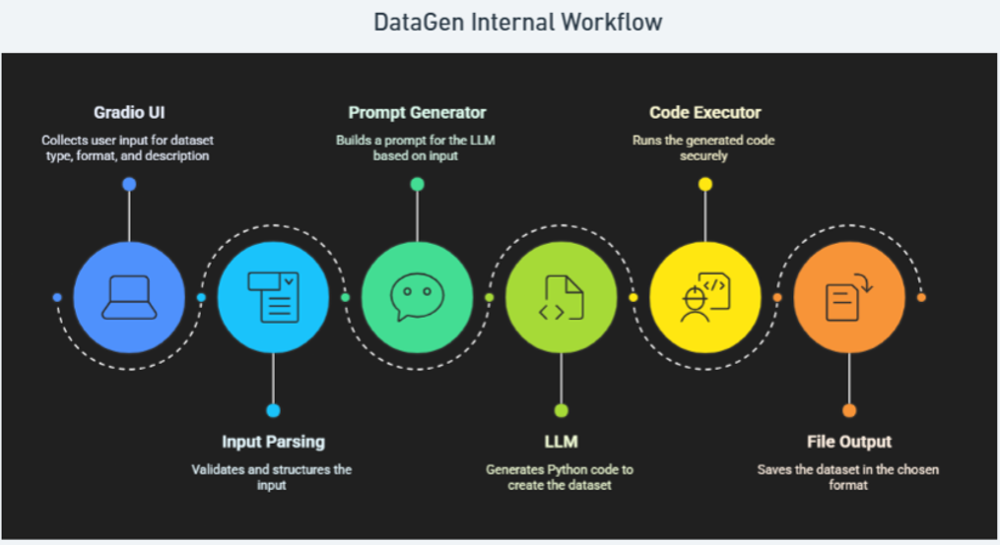

# 🏗️ DataGen Architecture

## How DataGen Works

DataGen transforms user descriptions into datasets through 6 steps:

1. **Gradio UI** - Collects user input (description, format, type)
2. **Input Parsing** - Validates and structures the input
3. **Prompt Generator** - Creates LLM prompt based on requirements
4. **LLM** - Generates Python code to create the dataset
5. **Code Executor** - Safely runs the generated code
6. **File Output** - Saves dataset in chosen format

## Key Design

**AI-Generated Code Approach:** Instead of generating data directly, LLMs create Python code that generates consistent, scalable datasets.

**Tech Stack:** Gradio UI, OpenAI/Anthropic APIs, Python execution, Pandas/JSON/Parquet.